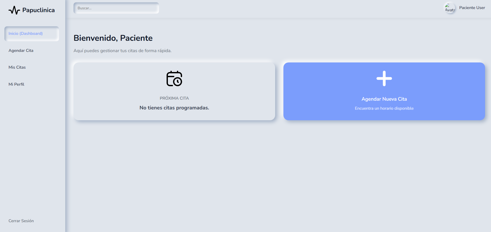
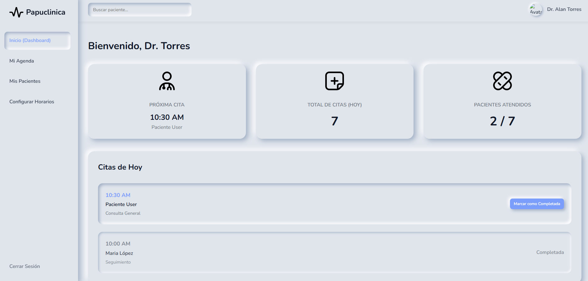
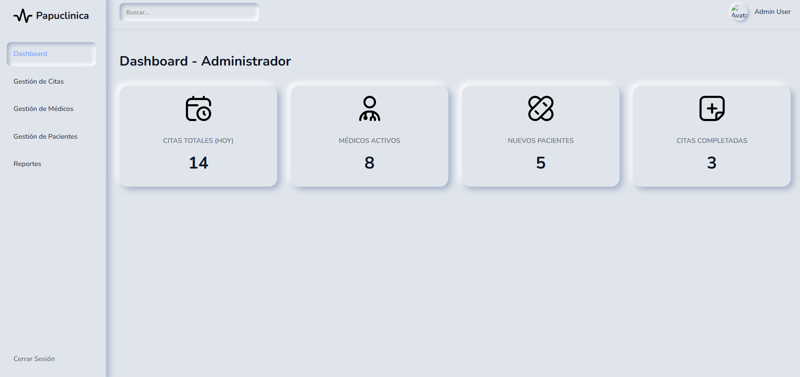

# Proyecto Final - Sistema de Gestión de Citas

Proyecto para gestionar citas médicas con paneles para paciente, médico y administrador.

**Descripción**:

Este repositorio contiene una aplicación web sencilla (PHP + MySQL) para el manejo de citas médicas. Incluye endpoints API básicos en `api/`, páginas estáticas en `HTML/` y recursos en `ASSETS/`.

**Tecnologías**:

- **Backend:** PHP
- **Base de datos:** MySQL
- **Frontend:** HTML, CSS, JavaScript
- **Servidor local:** MAMP

**Funcionalidades**:

- **Autenticación:** Iniciar sesión y cerrar sesión.
- **Registro de pacientes:** Formulario para registrar nuevos pacientes.
- **Agendar citas:** Pacientes pueden agendar citas con médicos.
- **Cancelar citas:** Opción para cancelar citas agendadas.
- **Gestión de médicos:** Listado y gestión básica de médicos desde el panel.
- **Paneles por rol:** Vistas separadas para paciente, médico y administrador.
- **API:** Endpoints en `api/` para operaciones principales (login, registro, citas, etc.).

**Estructura del proyecto**:

- `api/` - Endpoints PHP para la API.
- `HTML/` - Páginas estáticas del frontend.
- `ASSETS/` - Estilos y recursos (CSS, imágenes).
- `config/` - Configuración de base de datos y cabeceras.

### Vista del Paciente

### Vista del Medico

### Vista del Administrador

**Autor**: 

Equipo 7

**Integrantes**:

- Alexis Andrei Razo Armenta
- Axel Rainnier Vera Soto
- Daniel Diaz Medina

